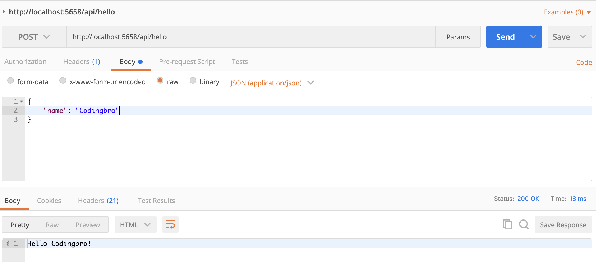

# express-node-skeleton
A hello-world express node skeleton project which exposes the /hello endpoint

### Sample Testing
Using Postman to hit the /api/hello endpoint

### Validity
Tested this project using Node 14.16.1 and npm 6.14.12.

